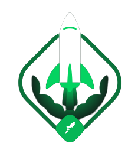
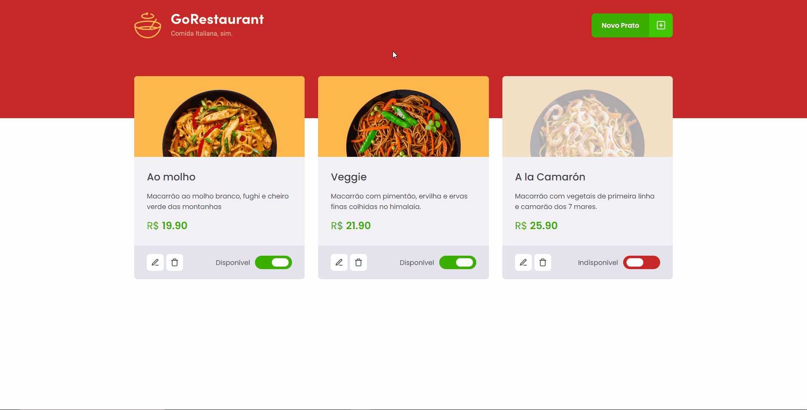

<br />

<h1 align="center">
  
  𝗥𝗼𝗰𝗸𝗲𝘁𝘀𝗲𝗮𝘁 𝗜𝗴𝗻𝗶𝘁𝗲 𝗥𝗲𝗮𝗰𝘁𝗝𝗦
</h1>

<div align="center">
  <a href="#technologies">Technologies</a>&nbsp;&nbsp;&nbsp;|&nbsp;&nbsp;&nbsp;
  <a href="#how-to-use">How To Use</a>
</div>

<div align="center">
  <p>🔎 <strong>About:</strong> Application made to create and manage Italian dishes.</p>
</div>
<br />

<div>
  <h2>⚔️ 𝗧𝗵𝗲 𝗰𝗵𝗮𝗹𝗹𝗲𝗻𝗴𝗲</h2>

  - [x] Migrate Javascript and class components application to Typescript and functional components
</div>

<div>
  <h2>👀 𝗣𝗿𝗲𝘃𝗶𝗲𝘄</h2>
  
</div>

<h2 id="technologies">⚡️ 𝗧𝗲𝗰𝗵𝗻𝗼𝗹𝗼𝗴𝗶𝗲𝘀</h2>

<ul>
  <li>ReactJS</li>
  <li>Typescript</li>
</ul>

<h2>📚 𝗨𝘀𝗲𝗱 𝗟𝗶𝗯𝗿𝗮𝗿𝗶𝗲𝘀/𝗣𝗮𝗰𝗸𝗮𝗴𝗲𝘀</h2>

<ul>
  <li>Styled components</li>
  <li>React icons</li>
  <li>Axios</li>
  <li>Unform</li>
  <li>React router</li>
</ul>

<h2 id="how-to-use">📌 𝗛𝗼𝘄 𝗧𝗼 𝗨𝘀𝗲</h2>

```bash
# Clone this repository
$ git clone https://github.com/LeonardoYz/GoRestaurant.git

# Go into repository
$ cd GoRestaurant

# Install dependencies
$ npm install

# Run application
$ npm start
```
